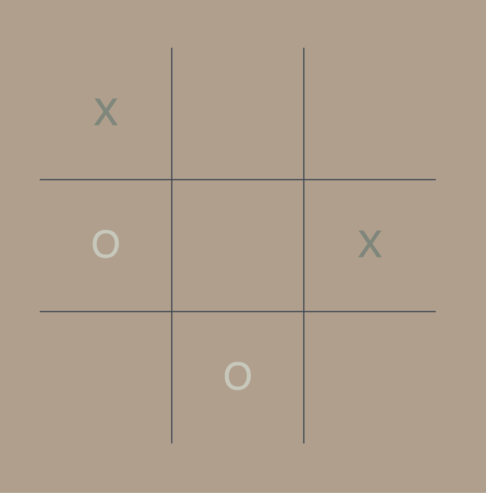

<h1 align="center">Hi 👋, I'm Djonathan Krause</h1>
<h3 align="center">You can call me DJ. I'm a Software Engineer from Brasil 🇧🇷</h3>

📫 Let's connect! Check my contact info on <a href="https://www.djonathan.com/" target="_blank">djonathan.com</a>

<h1>Projects</h1>

    <h3>Alexa Skill - Daily Stoic</h3>
    
    
 This is an Alexa Skill that will give you a new stoic quote everyday!  Download the Portuguese version
        <a href="https://www.amazon.com.br/Djonathan-Krause-Di%C3%A1rio-Estoico/dp/B0CRZ9Y9K7/ref=sr_1_8?qid=1708099314&refinements=p_72%3A17833783011&s=alexa-skills&sr=1-8">here</a> and the English version <a href="https://www.amazon.com.br/Djonathan-Krause-Di%C3%A1rio-Estoico/dp/B0CRZ9Y9K7/ref=sr_1_8?qid=1708099314&refinements=p_72%3A17833783011&s=alexa-skills&sr=1-8">here</a>.
        <a href="https://github.com/ThisIsDjonathan/alexa-skill-daily-stoic"> Here</a> is the GitHub with the implementation details.
    

    <h3>Audiobook Chapter Identifier</h3>
    
    
This bot identify the chapters in an audiobook hosted on YouTube 🔎🕵🏻‍♂️📋   Check the repo <a href="https://github.com/ThisIsDjonathan/youtube-audiobook-chapter-identifier" target="_blank">here</a>!

    <h3>Clone TabNews.com.br</h3>
    
    
This is a <a href="https://www.tabnews.com.br/" target="_blank">TabNews.com.br</a> clone we are building together on <a href="https://curso.dev/" target="_blank">curso.dev</a> 📚👓 You can take a look in the repo <a href="https://github.com/ThisIsDjonathan/clone-tabnews" target="_blank">here</a>!

    <h3>TicTacToe 3</h3>
    
    
A new version of the classic Tic Tac Toe game 🎲⭕❌.   This is work in progress. Check the repo <a href="https://github.com/ThisIsDjonathan/tictactoe3" target="_blank">here</a>.

